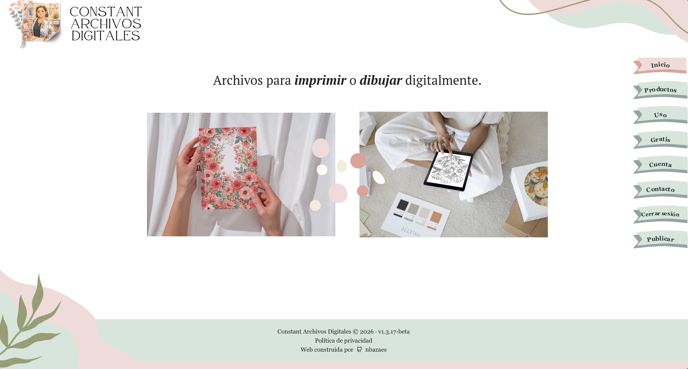

# webConstAD

Plataforma web construida para **[Constant Archivos Digitales](https://wca.nbazaes.app)**, una tienda de ilustración digital de la diseñadora Jenny Constant. El sitio permite a los clientes explorar, comprar y descargar archivos listos para imprimir o dibujar digitalmente.

## Stack

- **Backend:** Django (API REST, autenticación, flujo de publicación para administradores)
- **Frontend:** Astro (páginas estáticas, SSG)
- **Base de datos:** PostgreSQL

## Infraestructura

La aplicación está completamente contenedorizada y lista para producción:

- **Docker + Docker Compose** para orquestación
- **Nginx + Gunicorn** para servir la aplicación
- Soporte para **certificado SSL**
- Configuración de entorno mediante `.env`

## CI/CD

Incluye un workflow de GitHub Actions para despliegue automático en cada push.

## Licencia

El código fuente de este proyecto está licenciado bajo la [GNU General Public License v3.0](LICENSE).

Todos los archivos multimedia (imágenes, logos, ilustraciones y archivos descargables) contenidos en este repositorio son propiedad intelectual exclusiva de Jenny Constant y **no** están cubiertos por la licencia GPL-3.0. Todos los derechos reservados. Ver [NOTICE](NOTICE) para más detalles.
